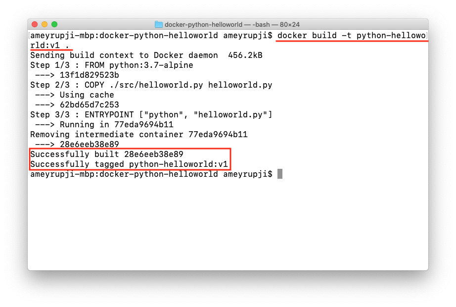
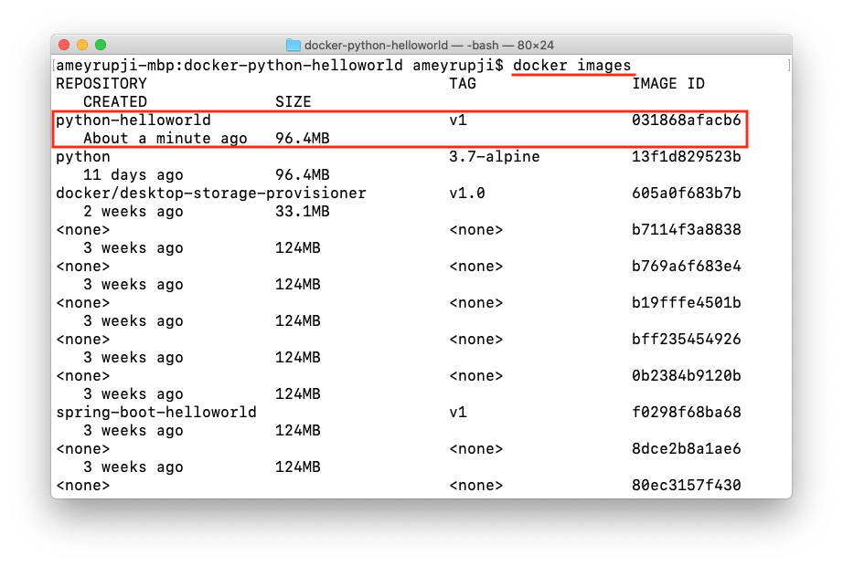
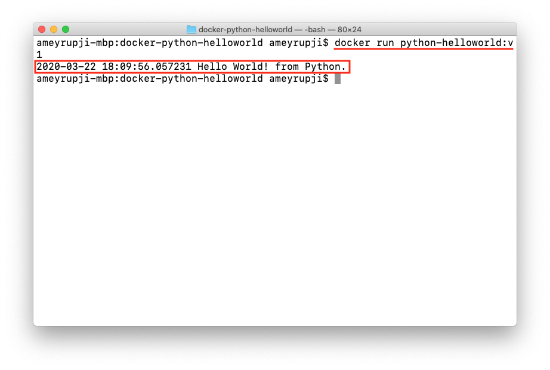
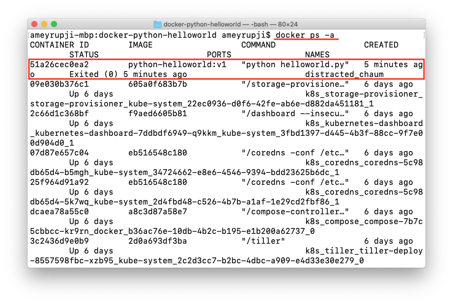

| [◂ Previous](https://github.com/ameyrupji-k8s/python-helloworld) |
|-----|

# docker-python-helloworld

Taking the simple python hello world script further. This example creates a docker container containing a python hello world script thar prints "Hello World!".

**Note:** Refer [python-helloworld](https://github.com/ameyrupji-k8s/python-helloworld) repo.

## Prerequisites

- Python - >=3.5
- Visual Studio Code
- Docker

## System Configuration at time of test

- macOS Catalina - Version 10.15.3
- Python - Version 3.7.6
- Docker Desktop - Version 2.2.0.4 (43472)

## Initial Setup

### Creating Python code

Follow the steps outlined in [python-helloworld](https://github.com/ameyrupji-k8s/python-helloworld) GitHub project to create a the Python script.

### Code

Add `Dockerfile`

```sh
FROM python:3.7-alpine
COPY ./src/helloworld.py helloworld.py

ENTRYPOINT ["python", "helloworld.py"]
```

### Build docker image

To build the docker image run the following command on the terminal: `docker build -t python-helloworld:v1 .`



To list the created docker images run the command on the terminal: `docker images`




## Test

Run the following command to spin up the container server: `docker run python-helloworld:v1`



To list all the containers running run this command on the terminal: `docker ps -a`




## Cleanup

To delete the container that was created use this command: `docker rm {container_id}`

To delete the docker image that was created: `docker rmi python-helloworld:v1`


## Useful Links

- https://medium.com/@pandit.summit/kubernetes-cron-job-with-python-image-in-minikube-windows-10-ac33851d573d
- https://github.com/ameyrupji-k8s/python-helloworld
- https://github.com/ameyrupji-k8s/docker-nginx-static-html-demo
- https://github.com/ameyrupji-k8s/docker-spring-boot-helloworld


| [Next ▸](https://github.com/ameyrupji-k8s/k8s-cronjob-python-helloworld) |
|-----|
